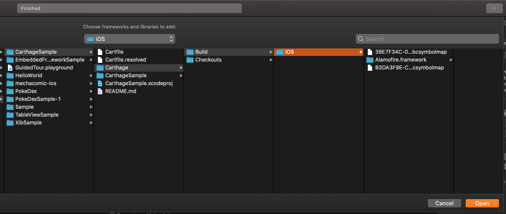

# CarthageSample

## Carthageとは

- Cocoa用ライブラリ管理ツール。
- AndroidにおけるGradleにあたるもの。

## Carthage vs CocoaPods

|  | Carthage | CocoaPods |
| --- | --- | --- |
| ビルド時間 | **短い** | 長い |
| 対応ライブラリ | 少ない | 多い |
| 導入難易度 | 高い | 低い |
| バージョン管理 | 難しい | 簡単 |
| xCode仕様変更への柔軟性 | **高い** | 低い |

## 導入手順

###  1.MacにCarthageをインストールする。

```
$ brew install carthage
```

### 2.プロジェクト直下にCartfileを作成する。

### 3.インストールしたいライブラリをCartfileに追記する。

例) Alamofire

```
github "Alamofire/Alamofire"
```

### 4.CartfileからFrameworkを作成する。

```
$ carthage update --platform iOS --no-use-binaries
```

成功すると、Cartfile.resolvedが作成される。

### 5.Frameworkをリンクする。

プロジェクト設定 → Target → General　→　Frameworkds, Libraries, and Embedded Contentから追加する。

4が成功していた場合は、`Project/Carthage/Build/iOS/`の下に目的のFrameworkが作成されている。

